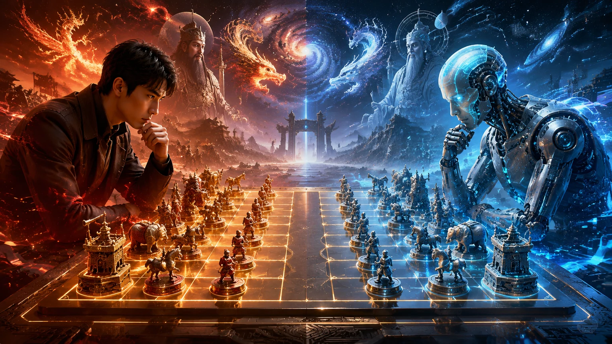

# 👑 科王象棋 / KW Chess

八冠王败后，棋魂醒来。  
一场关于你、AI 时代与新棋盘诞生的象棋剧情游戏。

[🎮 点击即玩](https://kw66.github.io/kw-chess/) · [🕹️ 作者游戏合集](https://kw66.github.io/games/)

 

## ✨ 当前版本

当前线上版本是 **剧情主线版**：先完整呈现《科王象棋》的故事，并在关键事件中接入真实棋局，让玩家从“八冠王”一路走到棋魂觉醒。

| 内容 | 说明 |
| --- | --- |
| 主角 | 你，象棋界年少成名的八冠王 |
| 对手 | 横空出世的 AI，靠计算、训练和快速学习压过旧棋盘 |
| 主线 | 人机大战首败 → AI 蒸馏棋风 → 自选棋魂觉醒 → 每天领先一枚棋子 → 第九局全魂决战 |
| 玩法状态 | 剧情事件已接入真实棋盘；棋魂选择前可查看走法教学，局内选子会显示结构化走法提示 |
| 对局功能 | 棋盘内的选子、AI、悔棋、认输、直接取胜测试按钮和结算沿用原游戏实现 |
| 进度 | 浏览器本地保存 |

## 📖 剧情结构

| 篇章 | 核心事件 |
| --- | --- |
| 序章 | 你少年封王，八冠加身，成为旧棋盘里最耀眼的人 |
| 第一幕 | AI 横空出世，人类棋手接连倒下 |
| 第二幕 | 十五局八胜开战，第一局让你看见旧棋的终点 |
| 第三幕 | AI 宣布已经蒸馏你的棋风，棋盒深处却传来第一声回响 |
| 第四幕 | 你选择第一枚棋魂，让棋子带着超自然力量走出旧规则 |
| 第五幕 | 每天只亮出一枚新棋魂；AI 次日学会昨天的能力，你必须始终领先一点 |
| 终幕 | 第九局前，比分来到 AI 1 : 7 你；双方七魂全开，你必须拿下第八胜 |

## 🧠 AI 与棋魂设定

故事里的 AI 不是传统反派，而是旧规则里最强的学习者。

| 系统 | 剧情含义 |
| --- | --- |
| 计算 | AI 能把普通棋盘上的希望一点点算干净 |
| 自我训练 | 它不断迭代版本，越过人类经验的边界 |
| 快速学习 | 第一局后，AI 用知识蒸馏掌握你的棋风；之后每一夜都会学习你当天暴露的棋魂 |
| 棋魂 | 你在旧规则走到尽头后唤醒的新规则，也是后续真实棋局的核心机制 |
| 路线选择 | 第 2-8 局由玩家决定觉醒顺序；选择页先展示走法和例子，确认后进入对应觉醒剧情 |
| 时间线改写 | 回到旧选择并改选，会清除之后的路线和对局结果，让觉醒顺序重新成立 |

## 🚀 发布包

这个仓库当前只保留线上剧情版必需文件。

| 路径 | 用途 |
| --- | --- |
| [`index.html`](./index.html) | GitHub Pages 主入口 |
| [`index-legacy.html`](./index-legacy.html) | 真实棋盘运行时，供剧情棋局内嵌调用 |
| [`assets/story.css`](./assets/story.css) | 剧情页面样式 |
| [`assets/story.js`](./assets/story.js) | 剧情数据、进度保存与交互逻辑 |
| [`assets/story-art/`](./assets/story-art/) | 封面与后续剧情视觉资源 |
| [`.nojekyll`](./.nojekyll) | GitHub Pages 静态发布标记 |

练兵场入口暂时隐藏，旧版完整对弈代码已用 Git tag 封存：`legacy-gameplay-before-story-20260606`。当前剧情棋局通过 `index-legacy.html` 内嵌运行，保证棋盘内操作和显示仍沿用原游戏。

剧情版还内置“信息与设置”面板，包含作者信息、进度存档/读档/重开、通关后的觉醒顺序统计，以及全站访问与访客统计。

## 🛠️ 后续计划

| 顺序 | 目标 |
| --- | --- |
| 1 | 继续微调移动端棋盘操作手感和小屏阅读密度 |
| 2 | 打磨剧情演出细节，让关键转折和插图衔接更自然 |
| 3 | 继续根据实测调整剧情棋局的目标条件和 AI 节奏 |
| 4 | 恢复并重构练兵场入口，但不打断主线剧情体验 |
