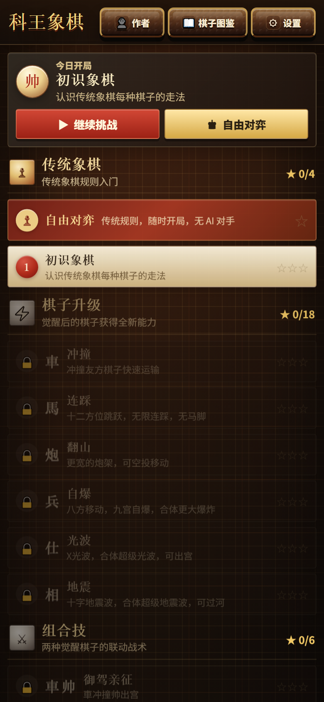
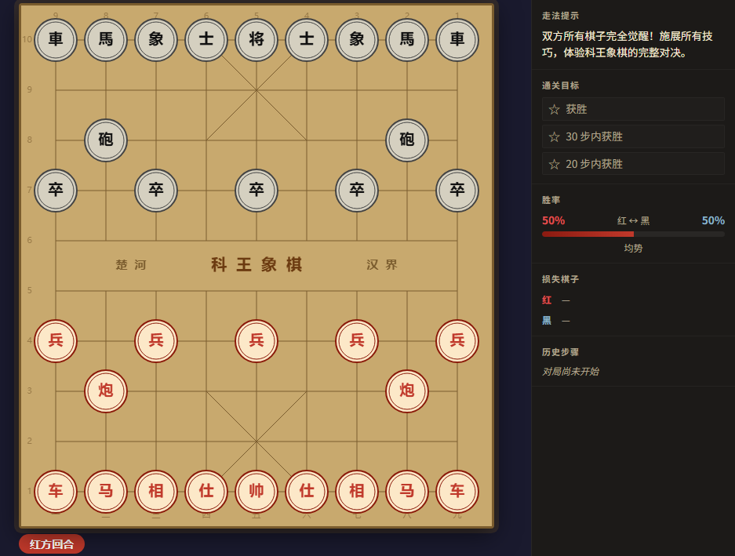

# 👑 科王象棋 / KW Chess

传统象棋开局，觉醒规则破局。 
车能冲撞，马能连踩，兵能自爆，王也可以亲自出征。

[🎮 点击即玩](https://kw66.github.io/kw-chess/) ·
[🏠 个人主页](https://kw66.github.io/)

  
  

## ✨ 游戏简介

《科王象棋 / KW Chess》是一款中国象棋变体策略游戏。

你会从熟悉的传统象棋开始，一步步解锁觉醒棋子、组合技和车马炮兵仕相帅觉醒规则。越到后面，棋盘越不像“慢慢兑子”的传统对局，而更像一场充满突进、连击、运输、爆破和反杀的战术战。

## 🎮 核心玩法

<table>
  <tr>
    <th style="white-space: nowrap;">玩法</th>
    <th>内容</th>
  </tr>
  <tr>
    <td style="white-space: nowrap;">♟️ 传统象棋</td>
    <td>先熟悉车、马、炮、兵、士、象、帅的基础走法</td>
  </tr>
  <tr>
    <td style="white-space: nowrap;">⚡ 棋子觉醒</td>
    <td>每类棋子都会获得新能力，不只是数值变强</td>
  </tr>
  <tr>
    <td style="white-space: nowrap;">🧩 关卡挑战</td>
    <td>每一关都有星级目标，鼓励你尝试不同打法</td>
  </tr>
  <tr>
    <td style="white-space: nowrap;">🤖 AI 对弈</td>
    <td>挑战关卡会有 AI 对手，适合反复练习和试招</td>
  </tr>
  <tr>
    <td style="white-space: nowrap;">📊 局势面板</td>
    <td>实时显示胜率、损失棋子、历史步骤和通关目标</td>
  </tr>
  <tr>
    <td style="white-space: nowrap;">🕹️ 自由对弈</td>
    <td>可以直接开一局传统规则或全觉醒规则</td>
  </tr>
</table>

## 🔥 觉醒能力

<table>
  <tr>
    <th style="white-space: nowrap;">棋子</th>
    <th style="white-space: nowrap;">觉醒能力</th>
    <th>战术感觉</th>
  </tr>
  <tr>
    <td style="white-space: nowrap;">车</td>
    <td style="white-space: nowrap;">冲撞、运输友方棋子</td>
    <td>把兵、王或关键棋子送到更有威胁的位置</td>
  </tr>
  <tr>
    <td style="white-space: nowrap;">马</td>
    <td style="white-space: nowrap;">无马腿、连踩</td>
    <td>切后排、打连击、制造突然翻盘</td>
  </tr>
  <tr>
    <td style="white-space: nowrap;">炮</td>
    <td style="white-space: nowrap;">更强的远线压制</td>
    <td>不只是立刻吃子，也能逼对手改阵</td>
  </tr>
  <tr>
    <td style="white-space: nowrap;">兵</td>
    <td style="white-space: nowrap;">叠层推进、自爆</td>
    <td>从小兵变成能改变局势的战术触发器</td>
  </tr>
  <tr>
    <td style="white-space: nowrap;">士 / 象</td>
    <td style="white-space: nowrap;">光波、地震、参与进攻</td>
    <td>不再只守家，可以主动制造威胁</td>
  </tr>
  <tr>
    <td style="white-space: nowrap;">王</td>
    <td style="white-space: nowrap;">出征、吃子、成长</td>
    <td>不只是被保护的目标，也能亲自进攻</td>
  </tr>
</table>

## 🤖 AI 算法与训练

KW Chess 的 AI 会按当前关卡规则推演局面，而不是只盯着眼前能不能吃子。它会先生成合法走法，再向后搜索几步，比较不同选择带来的局势变化。

<table>
  <tr>
    <th style="white-space: nowrap;">模块</th>
    <th>设计思路</th>
  </tr>
  <tr>
    <td style="white-space: nowrap;">规则层</td>
    <td>传统、部分觉醒、车马炮兵仕相帅觉醒会走不同规则分支，确保 AI 理解当前棋子的能力</td>
  </tr>
  <tr>
    <td style="white-space: nowrap;">搜索层</td>
    <td>以 NegaMax + Alpha-Beta 为核心，在有限思考时间内逐层加深</td>
  </tr>
  <tr>
    <td style="white-space: nowrap;">优化层</td>
    <td>配合走法排序、置换表、静态搜索与剪枝，减少明显不必要的分支</td>
  </tr>
  <tr>
    <td style="white-space: nowrap;">评估层</td>
    <td>不只看子力价值，也看叠层厚度、车的运输路线、马的连踩机会、炮线威胁、兵的爆破收益，以及王的安全和进攻时机</td>
  </tr>
  <tr>
    <td style="white-space: nowrap;">训练层</td>
    <td>通过离线自对弈让不同版本反复交手，观察哪些判断更稳定、更像真正会利用觉醒规则的棋手</td>
  </tr>
</table>

线上版本只保留玩家对弈需要的 AI 逻辑，不上传训练日志和实验结果。

## 🚀 快速开始

<table>
  <tr>
    <th style="white-space: nowrap;">方式</th>
    <th>说明</th>
  </tr>
  <tr>
    <td style="white-space: nowrap;">在线试玩</td>
    <td>直接打开 <a href="https://kw66.github.io/kw-chess/">kw66.github.io/kw-chess</a></td>
  </tr>
  <tr>
    <td style="white-space: nowrap;">本地试玩</td>
    <td>下载仓库后，用任意静态服务器打开根目录的 <a href="./index.html">index.html</a></td>
  </tr>
  <tr>
    <td style="white-space: nowrap;">对局入口</td>
    <td>游戏主页面会自动加载 <a href="./index-legacy.html">index-legacy.html</a> 中的棋盘与 AI 逻辑</td>
  </tr>
</table>

## 🗂️ 发布包结构

本仓库只保留线上游玩需要的静态发布文件和 README 展示素材。

<table>
  <tr>
    <th style="white-space: nowrap;">路径</th>
    <th>说明</th>
  </tr>
  <tr>
    <td style="white-space: nowrap;"><a href="./index.html">index.html</a></td>
    <td>游戏主入口</td>
  </tr>
  <tr>
    <td style="white-space: nowrap;"><a href="./index-legacy.html">index-legacy.html</a></td>
    <td>棋盘、规则与 AI 对弈逻辑</td>
  </tr>
  <tr>
    <td style="white-space: nowrap;"><a href="./assets">assets/</a></td>
    <td>已构建的样式、脚本和 README 截图</td>
  </tr>
  <tr>
    <td style="white-space: nowrap;"><a href="./.nojekyll">.nojekyll</a></td>
    <td>静态站点发布标记</td>
  </tr>
</table>

## 📌 当前版本

<table>
  <tr>
    <th style="white-space: nowrap;">状态</th>
    <th>内容</th>
  </tr>
  <tr>
    <td style="white-space: nowrap;">✅</td>
    <td>传统象棋关卡</td>
  </tr>
  <tr>
    <td style="white-space: nowrap;">✅</td>
    <td>单棋子觉醒关卡</td>
  </tr>
  <tr>
    <td style="white-space: nowrap;">✅</td>
    <td>组合技关卡</td>
  </tr>
  <tr>
    <td style="white-space: nowrap;">✅</td>
    <td>车马炮兵仕相帅觉醒的巅峰对决</td>
  </tr>
  <tr>
    <td style="white-space: nowrap;">✅</td>
    <td>AI 对手与胜率面板</td>
  </tr>
  <tr>
    <td style="white-space: nowrap;">✅</td>
    <td>在线游玩</td>
  </tr>
</table>
